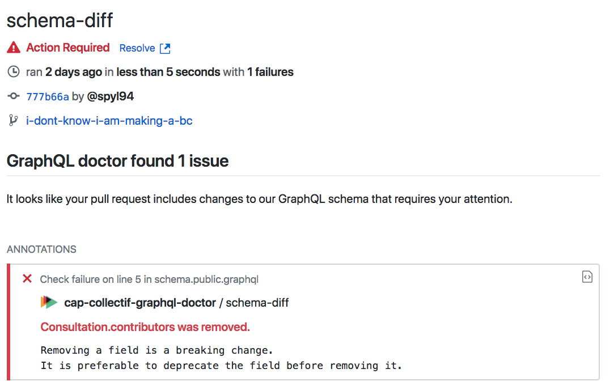

# GraphQL Doctor

> A GitHub App built with [Probot](https://probot.github.io) that prevent Breaking Changes in a GraphQL API using GitHub Checks API.

## Why

When using Continuous Evolution you have to prevent any Breaking Changes to your GraphQL API. That's why we recommend to commit a dump of your GraphQL schema (using SDL) inside your repository (eg: with a `pre-commit`).

`graphql-doctor` will use your current schema and compare it with the previous schema (eg: the schema on the `master` branch)  then it guess if you made some Breaking or Dangerous changes !

## Features 

#### Show issues right in your schema


#### Generate a failure in case of Breaking Changes



## Inspiration

This project was created because we, at Cap Collectif, wanted the same bot as used [internally at GitHub](https://speakerdeck.com/xuorig/continuous-evolution-of-graphql-schemas-at-github?slide=21). We mostly used [xuorig/graphql-schema_comparator](https://github.com/xuorig/graphql-schema_comparator) as an inspiration.

## Configuration

Add the following key to your `package.json` :

```json
  "graphql-doctor": {
    "schema.public.graphql": {
      "ref": "heads/master",
      "schemaPath": "schema.public.graphql"
    }
  },
```

This will compare your current `schema.public.graphql` against `schema.public.graphql` in the `master` branch.

## Deployment

We don't provide a public application (yet!) but you can easily deploy your own. Internally we are using heroku :

```sh
git push heroku master
```

## Contributing

### Setup

```sh
# Install dependencies
yarn install

# Run the bot
yarn start

# Run tests
yarn test
```

If you have suggestions for how graphql-doctor could be improved, or want to report a bug, open an issue! Any kind of contributions is greatly appreciated.

For more, check out the [Contributing Guide](CONTRIBUTING.md).

## License

[ISC](LICENSE)

## Credits

Created by [Aurélien David](https://spyl.net). Sponsored by [Cap Collectif](http://cap-collectif.com).
